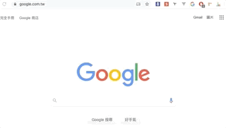

  

<h4 align="center"> Alexa and SimilarWeb Rank - Google 擴充套件 </h3>
<h5 align="center"> Alexa and SimilarWeb Rank - Google Extension</h3>
<a href="#about-this-project">
  
Click here to download page

</a>

## Table of Contents
- [About this project](#about-this-project)
- [How to use](#how-to-use)

## About this project 

This extension is utilized to assist users to get the public website ranking data from Alexa/similarWeb with a simple click.

只要簡單的點一下圖示，讓使用者可以取得 Alexa / SimilarWeb 的公開給大眾取用的排名數據。

## How to use
**Website 網站**

Please click the icon, and the website ranking data of the current page will show after a few moments. You can click the links to browse the full data from their official websites.

簡單的點一下按鈕，右上角的彈出視窗就會出現排名了。你可以點選連結來前往官方看數據完整內容。

    

## Author
- [Andy Lien](https://github.com/andy922200)

## Icon Credit
<h6>Icon made by <a href="https://www.flaticon.com/authors/freepik" target="_blank">Freepik</a> from 
<a href="https://www.flaticon.com/" target="_blank" rel="noopener noreferrer">https://www.flaticon.com/</h6>